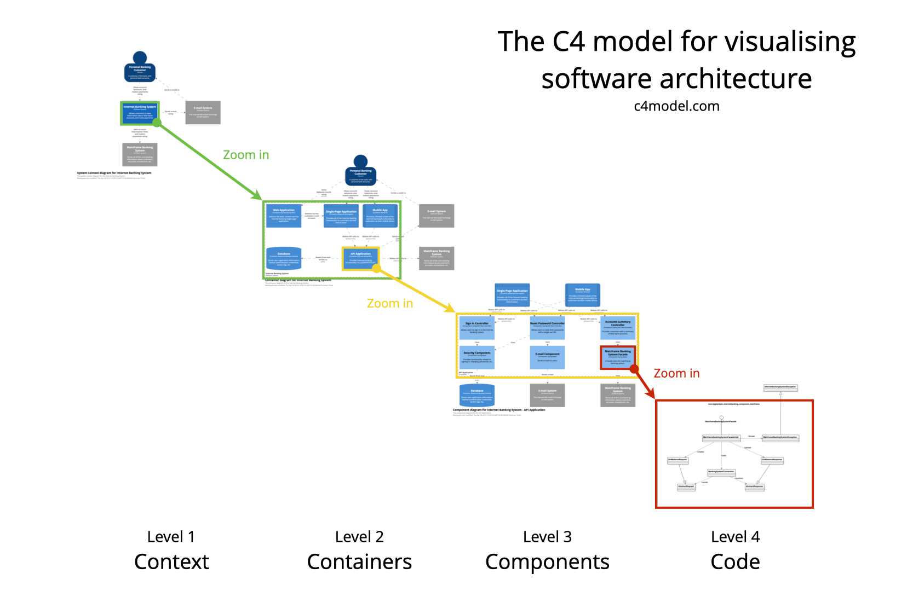

# C4Model JS

Before we can dive into C4MJS its important to re-cap what the C4 Model is first.

## C4 Model

> The C4 model was created as a way to help software development teams describe and communicate software architecture, both during up-front design sessions and when retrospectively documenting an existing codebase. It's a way to create maps of your code, at various levels of detail.

_See more about the C4 Model at https://c4model.com/_

## C4MJS

C4MJS is a set of Javascript based tools to enable you to create, maintain, publish and view your C4 Models.

It includes:

1. **@c4mjs/cli** _Command line utility to compile your workspace definition_
2. **[c4model.app](https://c4model.app/)** _App to view your workspace as interactive C4 Diagraphs_

## Motivation

Sharing architecture as a set of transient diagrams that convey just enough meaning to get by, built with
crude drawing tools leaving us with a patchwork quilt of barely legible information has no long term value to anyone.

> If you think good architecture is expensive, try bad architecture.
>
> **Brian Foote**

The goal with C4MJS is provide tooling to get an interactive map of your system architecture, do it without cost and enable developers
to get on with what they do best.

**_Which is not drawing pictures lets face it!!_**

- It should be maintained as simple text
- Reviewed using traditional development practices
- Easy to read and easy to interact with varying levels of detail
- No learning curve, no custom DSLs and be compatible with all existing tooling

The current version of C4MJS supports the first two levels of the C4 Model with support coming for level 3 soon.

